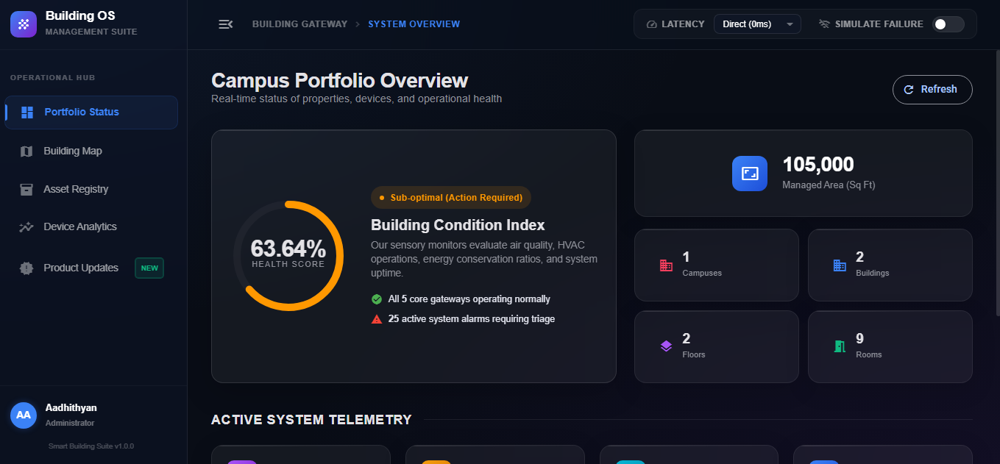
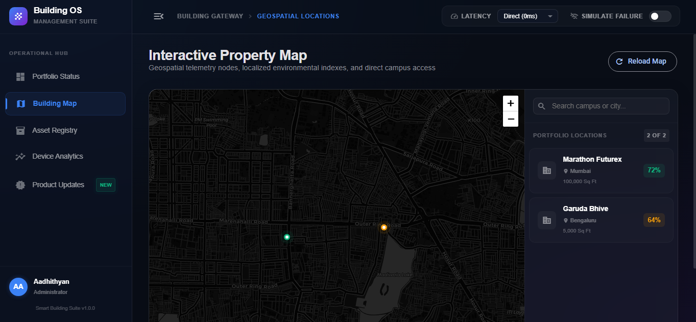
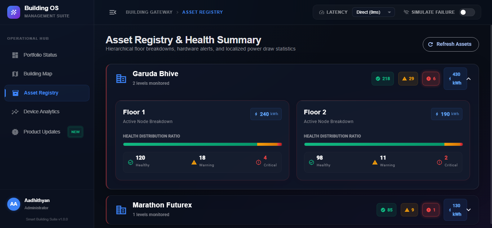
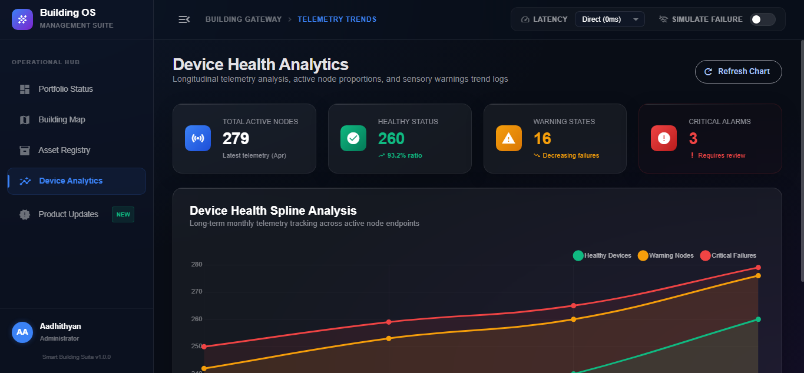
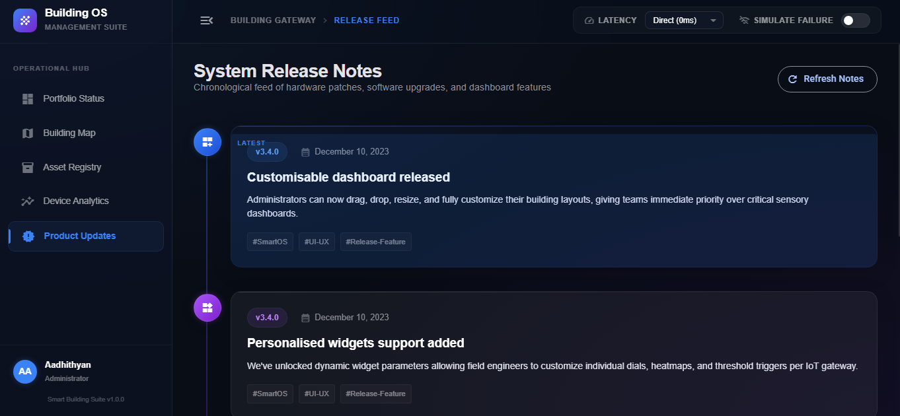

# 🏢 Smart Building Admin Dashboard

**[🚀 View Live Demo on Netlify](https://smart-building-dashboard-aa.netlify.app/)**

A modern, enterprise-grade Smart Building Administration Dashboard built with **Angular 21**, **Angular Material**, and **TypeScript**. This project demonstrates proficiency in component-based architecture, responsive design, data visualization, and asynchronous API handling.


---

## 📋 Table of Contents

- [Features](#-features)
- [Tech Stack](#-tech-stack)
- [Architecture](#-architecture)
- [Getting Started](#-getting-started)
- [Project Structure](#-project-structure)
- [Widgets](#-widgets)
- [Bonus Features](#-bonus-features)
- [Deployment](#-deployment)
- [Screenshots](#-screenshots)

---

## ✨ Features

| Feature | Description |
|---|---|
| 📊 **5 Interactive Widgets** | Organization Overview, Product Updates, Asset Health, Building Map, Device Analytics |
| 🎨 **Premium Dark UI** | Glassmorphism panels, neon accents, smooth micro-animations |
| 📱 **Fully Responsive** | Adapts seamlessly across desktop, tablet, and mobile viewports |
| ⏳ **Simulated Latency** | Configurable network delay (0ms–3s) via header controls |
| 💀 **Skeleton Loaders** | Custom shimmer loading states on every widget |
| ⚠️ **Error Handling** | Simulated API failures with retry fallback UI on all widgets |
| ♿ **Accessible** | ARIA labels, semantic HTML, keyboard navigable |
| 🗂️ **Clean Architecture** | Standalone components, centralized service layer, strict TypeScript |

---

## 🛠️ Tech Stack

| Layer | Technology |
|---|---|
| **Framework** | Angular 21 (Standalone Components) |
| **Language** | TypeScript 5.9 (Strict Mode) |
| **UI Library** | Angular Material + Angular CDK |
| **Styling** | SCSS with custom design tokens |
| **State Management** | Angular Signals (built-in reactive primitives) |
| **Charts** | Chart.js 4 (via CDN) |
| **Maps** | Leaflet + OpenStreetMap (via CDN) |
| **Data** | Local JSON files fetched via native `fetch()` API |
| **Build Tool** | Angular CLI + Vite |

---

## 🏗️ Architecture

```
┌─────────────────────────────────────────────────────┐
│                    App Shell                         │
│  ┌──────────┐  ┌──────────────────────────────────┐ │
│  │ Sidebar  │  │  Header (Simulation Controls)     │ │
│  │ (Nav)    │  ├──────────────────────────────────┤ │
│  │          │  │  Active Widget (Signal-driven)    │ │
│  │  ┌────┐  │  │  ┌────────────────────────────┐  │ │
│  │  │ W1 │  │  │  │  Component + Template       │  │ │
│  │  │ W2 │  │  │  │  ↕ DashboardService         │  │ │
│  │  │ W3 │  │  │  │  ↕ fetch('/data/*.json')     │  │ │
│  │  │ W4 │  │  │  └────────────────────────────┘  │ │
│  │  │ W5 │  │  │                                  │ │
│  │  └────┘  │  └──────────────────────────────────┘ │
│  └──────────┘                                       │
└─────────────────────────────────────────────────────┘
```

### Data Flow

1. **Mock API Layer** — Each widget's data lives in a separate JSON file under `/public/data/`.
2. **DashboardService** — A singleton injectable service that wraps `fetch()` calls with configurable latency (`setTimeout`) and error simulation (`forceError` signal).
3. **Component Layer** — Each widget component calls the service on `ngOnInit()`, managing its own `isLoading`, `errorMessage`, and `data` signals independently.
4. **State Management** — Angular Signals provide fine-grained reactivity without external libraries like NgRx or Redux.

---

## 🚀 Getting Started

### Prerequisites

- **Node.js** ≥ 20.x
- **npm** ≥ 10.x
- **Angular CLI** ≥ 21.x (`npm install -g @angular/cli`)

### Installation

```bash
# 1. Clone the repository
git clone https://github.com/<your-username>/smart-building-dashboard.git
cd smart-building-dashboard

# 2. Install dependencies
npm install

# 3. Start the development server
ng serve
```

### Access

Open your browser and navigate to **http://localhost:4200/**

---

## 📁 Project Structure

```
smart-building-dashboard/
├── public/
│   └── data/                          # Mock JSON API files
│       ├── overview.json              # Widget 1 data
│       ├── updates.json               # Widget 2 data
│       ├── assets.json                # Widget 3 data
│       ├── map.json                   # Widget 4 data
│       └── analytics.json            # Widget 5 data
├── src/
│   ├── app/
│   │   ├── components/
│   │   │   ├── organization-overview/ # Widget 1: KPI Cards + Health Gauge
│   │   │   ├── product-updates/       # Widget 2: Timeline Feed
│   │   │   ├── asset-health/          # Widget 3: Expandable Accordions
│   │   │   ├── building-map/          # Widget 4: Leaflet Map
│   │   │   └── device-analytics/      # Widget 5: Chart.js Area Chart
│   │   ├── services/
│   │   │   └── dashboard.service.ts   # Centralized API + simulation service
│   │   ├── app.ts                     # Root component
│   │   ├── app.html                   # Root template (sidebar + header + content)
│   │   ├── app.scss                   # Shell layout styles
│   │   └── app.config.ts             # Application configuration
│   ├── index.html                     # Entry point (CDN scripts for Leaflet/Chart.js)
│   └── styles.scss                   # Global styles + Google Fonts
├── angular.json                       # Angular workspace configuration
├── tsconfig.json                      # TypeScript strict configuration
└── package.json                       # Dependencies and scripts
```

---

## 📊 Widgets

### Widget 1: Organization Overview
- **KPI stat cards** for campuses, buildings, floors, rooms, users, assets, work orders, alarms, gateways, and devices
- **SVG radial health gauge** with animated stroke-dashoffset transitions
- Color-coded health status badges (Green/Orange/Red)

### Widget 2: Product Updates
- **Vertical timeline feed** with animated staggered entry
- SVG-based decorative pulsing nodes
- Version badges and relative date formatting

### Widget 3: Asset Health Summary
- **Expandable `MatExpansionPanel` accordions** per building
- Floor-level cards with **segmented health progress bars** (healthy / warning / critical)
- Dynamic aggregation of floor totals per building

### Widget 4: Interactive Building Map
- **Leaflet + OpenStreetMap** integration with custom pulsing `divIcon` markers
- Click-to-open popups showing building KPIs
- Cross-widget navigation bridge (popup → Asset Registry tab)

### Widget 5: Device Health Analytics
- **Chart.js stacked spline area chart** with neon gradient fills
- Custom HTML tooltips with backdrop blur
- Latest-month KPI summary cards with trend indicators

---

## 🏆 Bonus Features

### ✅ Architecture Bonuses
- **Strict TypeScript** — `strict: true`, `noImplicitReturns`, `strictTemplates` enabled in `tsconfig.json`
- **Angular Signals** — Modern built-in state management (no Redux/NgRx needed)
- **Reusable Dialog** — `MatDialog` component for building detail modals (triggered from Map widget)

### ✅ UX Enhancement Bonuses
- **Skeleton Loaders** — Custom CSS shimmer animations on all 5 widgets during loading
- **Error Boundaries** — All widgets display contextual error states with retry buttons
- **Smooth Animations** — CSS transitions, `@keyframes`, Chart.js animations, SVG stroke animations
- **Accessibility (ARIA)** — `aria-label`, `role`, `aria-live` attributes on interactive elements and dynamic content regions

### ✅ Deployment
- **Vercel** — See [Deployment section](#-deployment) below

---

## 🌐 Deployment

### Deploy to Vercel

```bash
# 1. Install Vercel CLI
npm install -g vercel

# 2. Build the production bundle
ng build --configuration production

# 3. Deploy the dist output
cd dist/smart-building-dashboard/browser
vercel --prod
```

### Deploy to Netlify

```bash
# 1. Build for production
ng build --configuration production

# 2. Drag & drop `dist/smart-building-dashboard/browser` folder to Netlify
# Or use Netlify CLI:
npm install -g netlify-cli
netlify deploy --prod --dir=dist/smart-building-dashboard/browser
```

### Deploy to GitHub Pages

```bash
# 1. Install angular-cli-ghpages
ng add angular-cli-ghpages

# 2. Build and deploy
ng deploy --base-href=/smart-building-dashboard/
```

---

## 📸 Screenshots

> **[📁 View all high-res screenshots and Demo Video on Google Drive](https://drive.google.com/drive/folders/1dZXtUsIUDx31oWvTqrEld6DpRwZYI33n?usp=sharing)**

### 1. Dashboard Overview


### 2. Property Map


### 3. Asset Registry


### 4. Health Analytics


### 5. Production Updates


| View | Description |
|---|---|
| **Portfolio Overview** | KPI cards with SVG radial health gauge |
| **Building Map** | Leaflet markers with interactive popups |
| **Asset Registry** | Expandable accordion panels per building |
| **Device Analytics** | Stacked area chart with neon gradients |
| **Product Updates** | Animated vertical timeline feed |
| **Error State** | Simulated API failure with retry button |
| **Loading State** | Custom shimmer skeleton loaders |

---

## 📝 License

This project is created as part of a frontend developer intern assessment.

---

**Built with ❤️ using Angular 21 + TypeScript + Angular Material**
